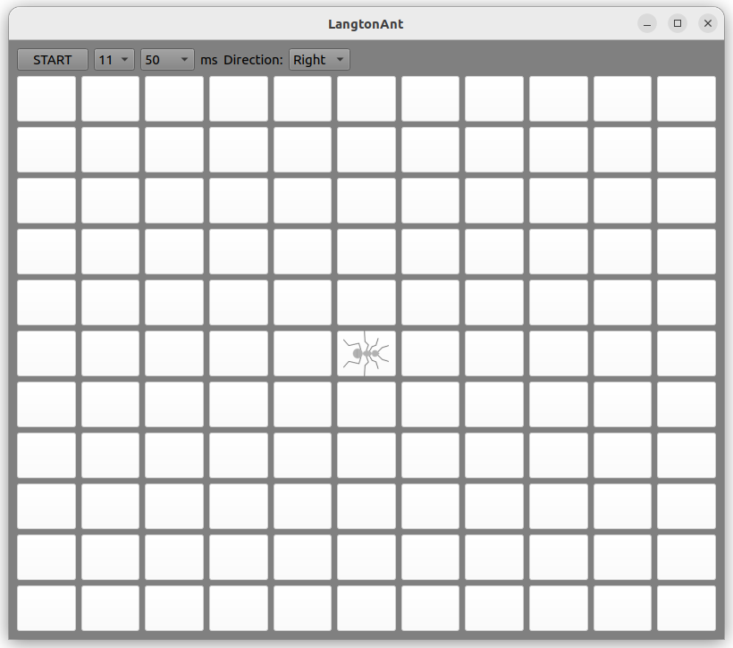
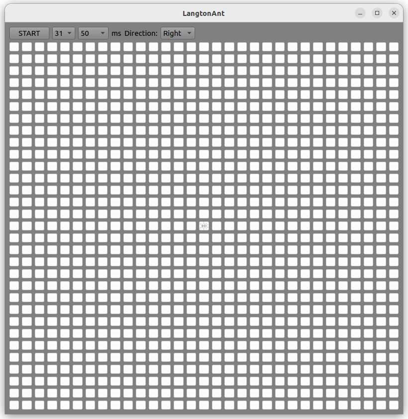

# Langton-Ant

Алгоритм Муравья Лэнгтона, реализованный на С++ и Qt.
Познакомимся с муравьём Лэнгтона поближе. Он живёт на бесконечной плоскости, состоящей из белых клеток. У него есть два неиссякаемых ведёрка — одно с белой краской, другое с чёрной. Муравей перемещается по клеткам плоскости от одной клетки к другой. При этом он выполняет несложный алгоритм:
1. Если клетка белая, то муравей перекрашивает её в чёрный цвет, поворачивает на 90° направо (по часовой стрелке) и делает шаг вперёд.
2. Если клетка чёрная, то муравей перекрашивает её в белый цвет, поворачивает на 90° налево (против часовой стрелке) и делает шаг вперёд.
Вот, собственно, и всё. Невесёлая жизнь у муравья Лэнгтона, но, как мы увидим, он не готов мириться с такой возмутительной ситуацией и всеми силами старается сбежать.

#### Главное окно приложения с полем минимального размера:

###### Можно установить:
- Размеры поля
- Скорость каждого шага муравья
- Первоначальное направление

#### Примеры нескольких шагов муравья:

#### Поле максимального размера:

