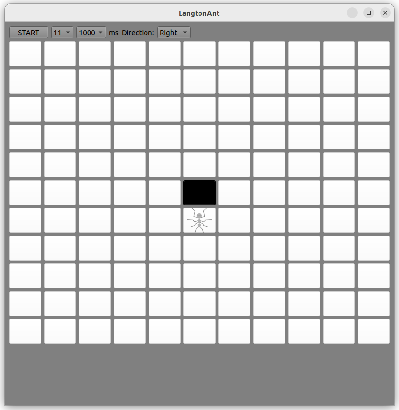
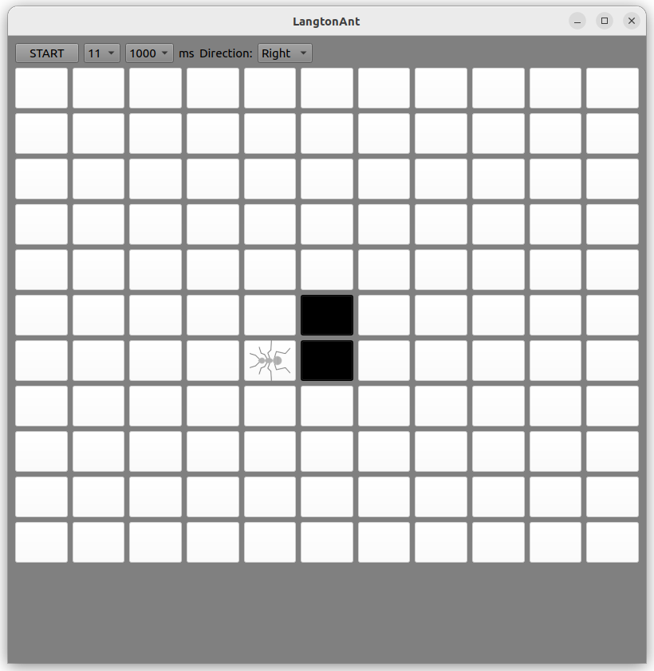
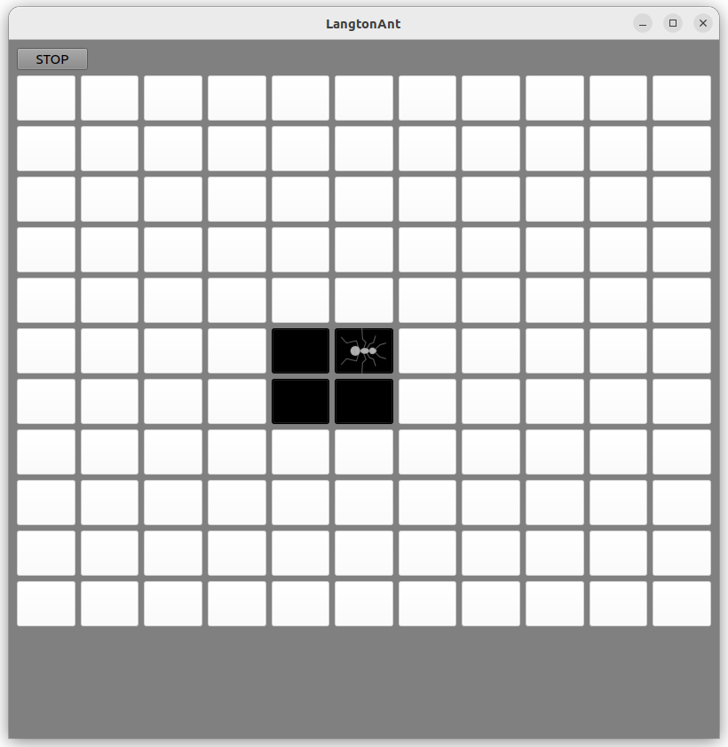

# LangtonAnt

Ant Langton algorithm implemented in S++ and Qt.

Let's get to know Langton's ant better. He lives on an endless plane consisting of white cells. He has two never-ending buckets - one with white paint, the other with black. The ant moves along the cells of the plane from one cell to another. In doing so, it implements a lightweight algorithm:

1. If the cell is white, then the ant repaints it black, turns 90° to the right (clockwise) and takes a step forward.
2. If the cell is black, then the ant repaints it white, turns 90° to the left (counterclockwise) and takes a step forward.
That's all, actually. Langton the ant has a sad life, but, as we will see, he is not ready to put up with such an outrageous situation and is trying with all his might to escape.

#### Main application window with minimum size field:

###### You can install:
- Field dimensions
- The speed of each ant step
- Initial direction

#### Examples of several ant steps:

#### Maximum field size:
